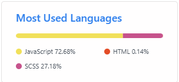
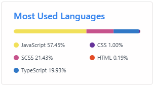

# React-Movie 프로젝트 회고

## 📌 프로젝트 개요

우아한 테크코스 프리코스 8기 오픈미션 과제로 진행한 영화 정보 제공 웹사이트 프로젝트입니다.

**배포 링크**: [React-Movie](https://kimsuro5773.github.io/React-Movie/)

## 오픈 미션의 의미

저의 오픈미션은 **나의 컴포트 존을 벗어나 익숙하지 않은 기술에 도전하기**입니다.
이번 프로젝트에서 제가 익숙하지 않은 기술을 적용한 내용은 다음과 같습니다.

- **Typescript 공부 및 첫 적용**

  - 타입스크립트를 학습과 동시에 실전 적용을 해봤습니다.

- **React 테스트 코드 작성**

  - 1, 2, 3주차에서 처음 학습했던 테스트 코드를 React에서의 테스트 코드를 작성하는 법을 배웠습니다.

- **CI/CD 파이프라인 구축 및 첫 배포**

  - CI/CD를 이용해 코드를 push하면 자동으로 빌드 및 테스트가 실행되고 배포가 되는 형식과 프로젝트를 개발서버가 아닌 실제 배포를 하는걸 첫 경험했습니다.

- **Tailwind 사용**

  - CSS 프레임 워크도 사용해보지 않았고 개발 속도가 빠르고 별도 CSS 관리가 필요 없는 Tailwind를 사용해봤습니다.  
    Tailwind를 학습하는 과정에서 UI 라이브러리인 shadcn을 알게되었고 이 프로젝트에 적용해봤습니다.

## 🛠️ 기술 스택

### Frontend

- **React**
- **Typescript**
- **Vite**
- **TanStack Query (React Query)**
- **Tailwind CSS**
- **React Router**

### Testing & CI/CD

- **Vitest**
- **Testing Library**
- **Github Actions**
- **Github Pages**

### API

- **TMDB API** - 영화 관련 데이터 제공

## 🎉 주요 기능

### 1. 영화 목록 조회

- 현재 상영중인 영화
- 인기 영화
- 최고 평점 영화
- 개봉 예정 영화

### 2. 영화 검색

- 영화 제목 검색

### 3. 영화 상세 정보

- 영화 정보 (장르, 상영시간, 평점 등)
- 유튜브 예고편 재생
- 추천 영화 목록
- 비슷한 영화 목록

## 📝 프로젝트 아키텍처

### 폴더 구조 - Feature-based

저는 리액트로 개발하면서 `Layer-based` 구조만 사용해왔습니다.
큰 프로젝트를 해본적이 없고 `Layer-based` 구조만으로 충분하다고 생각해 그렇게 사용해 왔는데 이번 프리코스 오픈 미션에서는 새로운 폴더 구조를 학습하고자 리팩토링 과정에서 `Feature-based` 구조로 변경하였습니다.

```
src/
├── features/
│   └── movies/
│       ├── api/              # API 호출 로직
│       ├── components/       # 영화 관련 컴포넌트
│       ├── hooks/            # Custom Hooks
│       ├── types/            # TypeScript 타입
│       ├── utils/            # 유틸 함수
│       └── constants/        # 상수
├── components/
│   ├── common/               # 공통 컴포넌트
│   ├── layout/               # 레이아웃 컴포넌트
│   └── ui/                   # UI 컴포넌트
├── pages/                    # 페이지 컴포넌트
├── lib/                      # 외부 라이브러리 설정
└── shared/                   # 공유 리소스
```

## 배운 점

### 1. 테스트 개발의 중요성

테스트 코드를 작성하면서 코드의 설계가 개선되었습니다.

먼저 코드를 작성하고 그 다음 테스트 코드를 작성한 후 제가 의도한 동작으로 실행이 되는지 테스트를 검사하는게 코드를 리팩토링 하는데 도움이 많이 됐습니다.

### 2. TypeScript의 가치

TypeScript를 처음 써보는 입장으로써 런타임 오류를 코드 작성 단계에서 바로 경고해주는게 얼마나 편리하고 유용한지 알게되었습니다.

또한 TMDB API 응답을 타입으로 정의할때 TypeScript가 문서와 설계의 역할도 할 수 있겠구나 생각이 들었습니다.

### 3. CI/CD (Lint → Test → Build → Deploy)

CI/CD 파이프라인을 구축하면서 코드를 push하면 자동으로 테스트(`구문오류, 타입오류 및 테스트 코드`)가 실행되고 배포되는 것이 매우 편리했습니다.

처음에는 워크플로우 YAML 문법이 낯설어서 이해하는 데 시간이 많이 걸렸는데 개발 생산성을 크게 향상 시킨다는 점에서 학습에 도움이 많이 됐습니다.

### 4. Tailwind

CSS를 사용할때 전처리기인 `SCSS`만 사용해봤는데 이번에 CSS 프레임워크인 `Tailwind`를 처음 사용해봤습니다.

정해진 스타일 문법이 있어 학습하는데 시간이 걸렸지만 익숙해지면 빠른 개발 속도를 낼 수 있다는 장점이 있을 것 같습니다.

특히 SCSS에서 IOS 모바일 환경에서 스크롤이 벗어나는 문제를 Tailwind를 설치 후 적용만 했는데 해결해줘서 신기했던 경험이 있네요 😀

## 🎁 결론

이번 오픈미션 프로젝트는 제가 부족한 점이 무엇인지 파악하고 모르는 기술을 학습하고 도전한 값진 경험이었습니다.

그래도 이번 오픈 미션을 통해 아직 배울게 많다고 생각이 많이 들었습니다.  
하지만 이번 경험으로 새로운 기술을 학습하는 두려움이 많이 줄어들었고  
다음에는 간단한 백엔드도 공부해서 적용해 나가면 재밌을거 같은 생각이 들었습니다

### 📊 GitHub 언어 통계 변화

- **프로젝트 시작 전** (2025-11-10)

  

- **프로젝트 완료 후** (2025-11-24)

  

## 🔗 관련 링크

- **배포 사이트**: [React-Movie](https://kimsuro5773.github.io/React-Movie/)
- **만들면서 공부 내용을 정리한 블로그**: [KimSuro velog](https://velog.io/@kimsuro/)

다음은 링크들은 학습에 도움이 많이 됐던 참고했던 블로그 및 영상들입니다.

- [[유튜브] 헤다의 프론트엔드 테스트 종류](https://www.youtube.com/watch?v=MN7Pw4mK6lU&t=244s)
- [[블로그] 달레님의 테스팅 관련 글](https://www.daleseo.com/?tag=testing)
- [[인프런] 한 입 크기로 잘라먹는 타입스크립트](https://www.inflearn.com/course/%ED%95%9C%EC%9E%85-%ED%81%AC%EA%B8%B0-%ED%83%80%EC%9E%85%EC%8A%A4%ED%81%AC%EB%A6%BD%ED%8A%B8)
- [[블로그] CI/CD 파이프 라인이란](https://inpa.tistory.com/entry/%F0%9F%91%A9%E2%80%8D%F0%9F%92%BB-CI-CD-%ED%8C%8C%EC%9D%B4%ED%94%84-%EB%9D%BC%EC%9D%B8-%EC%9D%B4%EB%9E%80)
